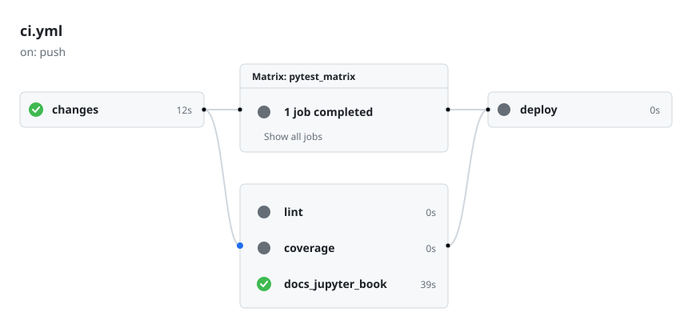
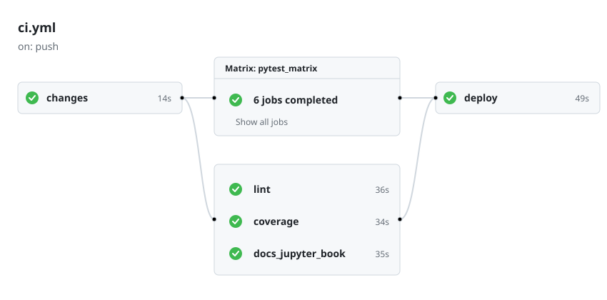

---
numbering:
    headings: false
---
(sec:contributing)=
# Contributing

Users may contribute to the Rattlesnake project by [cloning](https://docs.github.com/en/repositories/creating-and-managing-repositories/cloning-a-repository) or [forking](https://docs.github.com/en/pull-requests/collaborating-with-pull-requests/working-with-forks/fork-a-repo) the Rattlesnake [repository](https://github.com/sandialabs/rattlesnake-vibration-controller).

Direct **cloning** is reserved for authorized collaborators of the Rattlesnake repository; however, because the project is open-source, all other contributors can obtain their own copy by **forking** the repository.

## Cloning

* Cloning is a Git action.
* It creates a copy of a repository on **your physical computer**.
* It allows you to edit files and run code locally. Collaborators "clone" the original repository directly because they have permission to "push" (save) their changes directly back to the main project.
* External contributors usually "clone" *their own fork*.

## Forking

* Forking is a GitHub action.
* It is a personal copy of the entire project on **your own GitHub account**.
* It acts as a bridge for external contributors. You can make any changes you want to your fork without affecting the original project. When you are ready to share those changes, you submit a [**Pull Request**](https://github.com/sandialabs/rattlesnake-vibration-controller/pulls) to the original repository.

## Getting the Source Code

**Collaborators and team members** should **clone** the repository:

```bash
git clone git@github.com:sandialabs/rattlesnake-vibration-controller.git
```

Others should first **fork** the repository to their own GitHub account. Once forked, you can then clone your personal version of the repo to work on it locally.

## Installation

A [virtual environment](https://packaging.python.org/en/latest/guides/installing-using-pip-and-virtual-environments/) is **highly** recommended.
This ensures project dependencies do not conflict with the system-wide Python installation.

Create a new virtual environment folder within your project directory. It is conventional to name this folder `.venv`.

```bash
# macOS / Linux / Windows
python3 -m venv .venv
```

Activating the environment tells your shell to use the Python interpreter and pip packages located inside the `.venv` folder.

#### macOS / Linux:

```bash
source .venv/bin/activate
```

#### Windows (PowerShell):

```sh
.venv\Scripts\Activate.ps1
```

#### Windows (Command Prompt), DOS

```sh
.venv\Scripts\activate.bat
```

Once activated, your terminal prompt will typically show `(.venv)`. You can now install dependencies safely.

```bash
# Install specific packages, for example, the "requests" package
pip install requests

# Or install the entire Rattlesnake development in editable mode
pip install -e .[dev]
```

Confirm that your shell is pointing to the correct Python binary.

```bash
# macOS / Linux
which python

# Windows
where python
```

The output should point to a path inside your project's `.venv` folder.

To exit the virtual environment and return to the global system stack:

```bash
deactivate
```

> **Best Practice:** Never commit the `.venv` directory to version control. Add `.venv/` to your `.gitignore` file.

## Documentation

The online documentation is made with [Jupyter Book](https://jupyterbook.org).  Below are instructions for setting up a local development environment, building the book locally, and publishing the updates to the repository.

Install documentation dependencies either with `pip`

```sh
pip install "jupyter-book>=2.0.0"
```

or with [uv](https://docs.astral.sh/uv/)

```sh
uv add "jupyter-book"
```

### Local Build

Within this `documentation` folder, the `myst.yml` file specifies how Jupyter Book should build the documentation.  Importantly, it links to Markdown files that contain the book's content.

```sh
cd rattlesnake-vibration-controller/documentation
jupyter book build --html --strict
```

This will build the Jupyter Book documentation.

```{warning}
The foregoing command may not work behind a corporate firewall.
```

The output will be similar to:

```sh
building myst-cli session with API URL: https://api.mystmd.org
(node:93011) Warning: `--localstorage-file` was provided without a valid path
(Use `node --trace-warnings ...` to show where the warning was created)
🌎 Building Jupyter Book (via myst) site
📖 Built book/src/_generated/random_vibration_run_doc.md in 64 ms.
📖 Built book/src/chapter_13.md in 124 ms.
📖 Built book/src/notation.md in 117 ms.
📖 Built book/src/contributing.md in 117 ms.
<--(snip)-->
📚 Built 32 pages for project in 813 ms.
```

To view the Jupyter Book output locally:

```sh
jupyter book start
```

The output will be similar to:

```sh
📚 Built 32 pages for project in 974 ms.
<--(snip)-->
🔌 Server started on port 3000!  🥳 🎉

        👉  http://localhost:3000  👈
```

In a local web browser, navigate to the web address indicated above.

#### Bibliography

The documentation uses the `myst-nb` and standard MyST bibliography support.

1. Prepare your bibliography file:

References are stored in `documentation/book/bibliography.bib` using the standard BibLaTeX (`.bib`) format. Populate the file with references, e.g., 

```bibtex
@book{knuth1986computer,
  title={The Computer Science of TeX and Metafont: An Inaugural Lecture},
  author={Knuth, Donald E},
  year={1986},
  publisher={American Mathematical Society}
}
```

2. Configure `myst.yml`

The bibliography is configured in `documentation/myst.yml` under the `project.bibliography` section:

```yaml
project:
  bibliography:
    - book/bibliography.bib
```

3. Add in-text citations

In a markdown file, use the `cite` role to reference an entry by its key:

`{cite}` `knuth1986computer`

4. Build the book

Run the `jupyter book build` command from the `documentation` directory. The build system will automatically process the citations and generate the bibliography.

```sh
cd documentation
jupyter book build
```

## Continuous Integration/Continuous Deployment (CI/CD)

The separate concerns of **test**, **build**, **release**, and **publish** are contained in the `.github/workflows/` files.

* **Continuous Integration (CI)**
  * **Test (Verification)**
    * **Purpose:** To ensure that the code is functional and hasn't introduced regressions (broken existing features).
    * **Scope:** Tests are run on one or more versions of Python and on multiple operating systems (e.g., Linux, macOS, Windows).
    * **What happens:** Automated unit tests, integration tests, and code quality assessments are performed.
      * **Testing** (e.g., [pytest](https://docs.pytest.org/en/stable/)) runs your unit and integration tests.
      * **Code coverage** (e.g., pytest with a coverage report) assesses the number of lines of code covered by tests.
      * **Linting** (static code analysis, e.g., [pylint](https://pypi.org/project/pylint/)) and 
      * **Code Formatting** (e.g., [ruff](https://docs.astral.sh/ruff/)) checks ensure code consistency.
      *  **Documentation** may also be assembled and compiled.  This is particularly important for interactive documentation that has examples that depend on source code functionality.
    * **Key Outcome:** Confidence. If this stage fails, the process stops immediately, preventing broken code from ever reaching a user.
  * **Build (Packaging)**
    * **Purpose:** To transform your "human-readable" source code into "machine-installable" artifacts. This is the bridge between CI and CD. Once the code is verified (integrated), it can be packaged into a deployable format (Wheels/SDists).
    * **What happens:** Tools (like `python -m build`) bundle your code into standard formats, such as a Wheel (`.whl`) or a Source Distribution (`.tar.gz`).
     * **Key Outcome:** Portability. You now have a single file (an "artifact") that contains everything needed to install your library on any compatible system.
  * **Release (Documentation & Tagging)**
     * **Purpose:** To create an official "point-in-time" snapshot of the project for project management and users. It uses an immutable Git tag and GitHub Release page.
     * **What happens:** A permanent Git tag (like v1.0.0) is assigned to a specific commit. A GitHub Release page is generated with a Changelog (i.e., What's New?) and the build artifacts are attached to it as "Release Assets."
    * **Key Outcome:** Traceability. It provides a clear history of the project's evolution and a stable place for users to download specific versions.
* **Continuous Delivery (CD)**
  * **Publish (Distribution)**
     * **Purpose:** To make the software easily available to the global ecosystem.
     * **What happens:** The built artifacts are uploaded to a package registry, such as [PyPI](https://pypi.org/project/rattlesnake-vibration-controller/) (the Python Package Index).
     * **Key Outcome:** Accessibility. Once published, anyone in the world can install your software using a simple command like `pip install rattlesnake-vibration-controller`.

### Efficiency

When a user pushes to the repository, the `changes` job in the main workflow
determines the **types** of the files that were committed.  The job determines
if only `docs` (documentation) files changed, only `code` (source code, project code)
files changed, or both.  For example, upon pushing updates only to markdown (i.e., `*.md`)
files, the workflow makes this determination:

```bash
📂 Docs changed: true
📂 Docs files: documentation/book/src/contributing.md
💻 Code changed: false
💻 Code files:
```

The result is that only artifacts that rely on updates to documentation file
types are run, avoiding running unnecessary tests that *don't* rely on documentation.



Regardless of the file type, if the `main` or `dev` branch is target
of an update, *all tests* are run, for example,



### Test

Tests are grouped by the amount of time required to run the tests.  The current
groups are

```bash
tests/
tests/long/
tests/short/
```

Whenever there is a push or pull request to `main` or `dev`, **all tests** will run (which includes **long** tests). For pushes to branches other than `main` or `dev`, only tests in `tests/` and `tests/short` are run.

Developers can *force* a full test, which includes `tests/long` in addition to `tests/` and `tests/short`, by adding the string `[all tests]` to the commit message.  For example, on the `dev-cicd-docs` branch

```bash
(dev-cicd-docs) > git commit -m 'test feature foo with [all tests]'
```

will trigger all tests to be run.

### Trusted Publishing

In `release.yml` we have removed the manual `-p ${{ secrets.PYPI_TOKEN }}`.  The industry standard is now [**Trusted Publishing**](https://docs.pypi.org/trusted-publishers/) (also called OpenID Connect or OIDC).  You configure this in your PyPI project settings once, and GitHub Actions authenticates securely without you needing to store and rotate secrets.

> OpenID Connect (OIDC) provides a flexible, credential-free mechanism for delegating publishing authority for a PyPI package to a trusted third party service, like GitHub Actions.  PyPI users and projects can use trusted publishers to automate their release processes, without needing to use API tokens or passwords.

To configure Trusted Publishing, you tell PyPI, "Trust any code from this specific GitHub repository and workflow."  This removes the need to manage long-lived API tokens or passwords in your secrets.

Steps:

* In `release.yml`, the environment must be set to either `pypi` or `testpypi` depending on the version string.  Hence the logic in `release.yml`:

```bash
environment: ${{ (contains(github.ref, 'rc') || contains(github.ref, 'dev')) && 'testpypi' || 'pypi' }} # If the tag contains 'rc' or 'dev', use the 'testpypi' environment, otherwise use 'pypi'
```

The GitHub repository itself must have both a `pypi` and a `testpypi` environment:

On the GitHub repo:

* Click on the **Settings** tab (usually the last tab on the right in the top navigation bar).
* On the left-hand sidebar, look for the **Environments** link (it's under the "Code and automation" section).
  * If the environment doesn't exist yet:
    * Click the **New environment** button.
    * Name the environment `pypi` (and then make a second item called `testpypi`) and click **Configure environment**.
  * If it does exist but is named differently, you can click on it to rename it or delete it and create a new one.
* For a basic setup using Trusted Publishing, you don't actually need to add any secrets or configuration on this page. Just having the environment named testpypi exist is enough to link it to your workflow.
* Optionally, we add the following protections:
  * Under the **Deployment branches and tags**, under the **No Restriction** button, select **Selected branches and tags**.
  * Click **Add deployment branch or tag rule**.
  * Select **Ref type: Tag**.
  * Set the **Name Pattern:** to 'v*'.  This ensures that *only* version tags can ever use this environment, adding a layer of security.

Finally, the PyPI (respectively, Test PyPI) site needs to be configured.

* Log into your [PyPI](https://pypi.org) (or [Test PyPI](https://test.pypi.org)) account
* Go to your project's **Manage** page (or your account's **Publishing** settings if you are setting it up for the first time.)
* Look for the **Publishing** tab
* Click **Add new publisher**
* Select **GitHub** as the source
* Enter the following details:
  * Owner: sandialabs
  * Repository name: rattlesnake-vibration-controller
  * Workflow name: `release.yml` (This must match your filename in your `.github/workflows/` directory)
  * Environment name: You can leave this blank or name it `pypi` (if you use it in your YAML).  We used 
    * `pypi` for live publishing to the PyPI site, and
    * `testpypi` for test publishing to the TestPyPI site.
  * Click the **Add** button

### Tags and Semantic Versioning

We follow [PEP 440](https://peps.python.org/pep-0440/) (the Python standard for versioning), which requires version strings to follow this specific structure:

```bash
N.N.N[{a|b|rc}N][.postN][.devN]
```

#### Example Tags

Following are **prerelease tags**:

tag | description
--- | ---
`v1.1.0a1` | The first **alpha** for version 1.1.0
`v1.1.0b2` | The second **beta** for version 1.1.0
`v1.1.0rc1` | The first **release candidate** for version 1.1.0

A **release candidate** is made during the final testing stage before a full release.

Following are **stable release tags** (e.g., starting from the `v1.0.0` release):

tag | description
--- | ----
`v1.0.1` | **Patch Release**: Backwards-compatible bug fixes
`v1.1.0` | **Minor Release**: New features that are backwards-compatible
`v2.0.0` | **Major Release**: Significant changes or breaking API updates

Following are **Development** and **Post-Release** tags:

tag | description
--- | ---
`v1.1.0.dev1` | A version currently under development
`v1.0.0.post1` | Fix a minor error in the release process, such as a fix of a typo in the documentation, without changing the code

### Release on Tag

Following is an example of creating a release with a tag.

#### Create a Prerelease

To create a prerelease on TestPyPI:

* On any development branch, e.g., `dev-cicd-docs`, create a tag and then push, e.g.,

```sh
# View existing tags, if any
git tag

# Create the new tag, e.g.,
git tag -a v1.0.0rc1 -m "Test of prerelease version 1.0.0, release candidate 1"

# On the main branch, push the tag to GitHub
git push origin v1.0.0rc1
```

To create a release on PyPI:

* Merge the `dev` branch into the `main` branch.
* On the `main` branch, `git tag` and push to `main`, e.g.,

```sh
# Ensure you are on the main branch
git checkout main
git pull

# View existing tags, if any
git tag

# Create the new tag, e.g.,
git tag -a v1.0.0 -m "Release version 1.0.0"

# On the main branch, push the tag to GitHub
git push origin v1.0.0
```